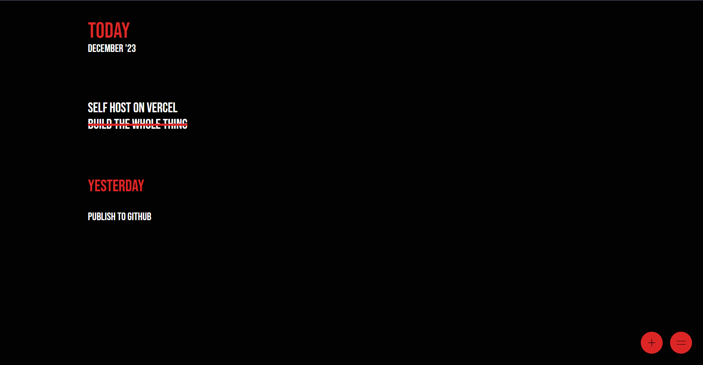
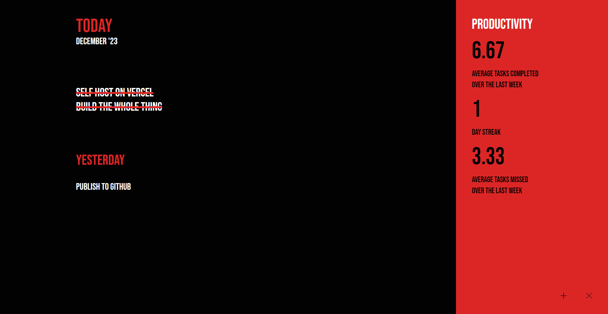

# Today

An as simple as it gets task manager without noise. No planning for tomorrow, no automations, no fancy features. Just tasks and some basic performance. Only if you want to see them. Self-hosted, so your data is your data. Works on [Deta](https://deta.space). No history of tasks, no future planning to waste time on, work on what is important today, and what you forgot yesterday.

Want to use postgres? Well, too bad, you'll have to fork and edit it youreslf.

And yes, it works on mobile.

## I'm too stupid to understand how it works

1. Click to mark as done or vice versa.
2. Right click to delete.
3. Click on "+" to create new task.
4. Click on "=" to access statistics.
    - Streak is the number of days you completed atleast 1 task at a stretch.
    - Check the code for detailed calculations.
5. Click on "X" to close the statistics pane.
6. Defocus the input to cancel task creation.

### Screenshots

